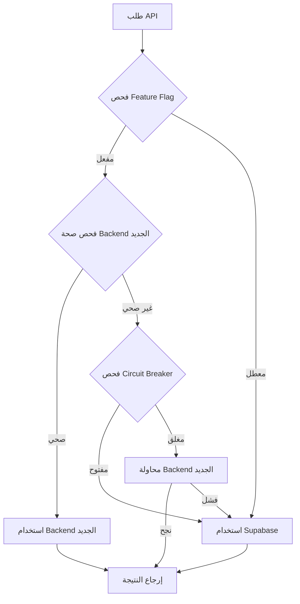

# دليل التكامل - المرحلة الأولى
# Phase 1 Integration Guide - SPSA

## 📋 نظرة عامة

تم تطوير المرحلة الأولى من التكامل التدريجي المحكم بنجاح، والتي تشمل إنشاء طبقة تكامل موحدة بين النظام الجديد (Node.js/Express) ونظام Supabase الحالي مع آليات fallback ذكية.

## 🎯 المكونات المطورة

### 1. خدمة API الموحدة (UnifiedApiService)

**الملف:** `src/services/unifiedApiService.js`

**الميزات:**
- ✅ آلية fallback تلقائية بين الخدمات
- ✅ Circuit breaker pattern للحماية من الأعطال
- ✅ مراقبة صحة الخدمات في الوقت الفعلي
- ✅ إعادة المحاولة التلقائية مع exponential backoff
- ✅ تتبع الأداء والمقاييس
- ✅ دعم feature flags للتحكم في الخدمات

**استخدام الخدمة:**
```javascript
import unifiedApiService from '../services/unifiedApiService.js';

// طلب API مع fallback تلقائي
const response = await unifiedApiService.request('/auth/login', {
  method: 'POST',
  data: { email, password },
  requestType: 'AUTH',
  retryOnFailure: true
});

// فحص حالة الخدمات
const status = unifiedApiService.getServiceStatus();
console.log('Service Status:', status);
```

### 2. نظام Feature Flags

**الملف:** `src/config/featureFlags.js`

**الميزات:**
- ✅ تحكم في تفعيل/إلغاء الميزات حسب البيئة
- ✅ دعم A/B testing مع rollout تدريجي
- ✅ flags خاصة بالأدوار والمستخدمين
- ✅ تحديث ديناميكي للـ flags
- ✅ إحصائيات وتتبع الاستخدام

**استخدام Feature Flags:**
```javascript
import { getFeatureFlag, setFeatureFlag, isFeatureEnabled } from '../config/featureFlags.js';

// فحص feature flag
if (isFeatureEnabled('USE_NEW_AUTH')) {
  // استخدام النظام الجديد
}

// تحديث flag (للتطوير)
setFeatureFlag('USE_NEW_CONTENT', true);

// الاستماع لتغييرات الـ flags
addFeatureFlagListener('USE_NEW_AUTH', (value) => {
  console.log('Auth flag changed:', value);
});
```

### 3. نظام المراقبة والتتبع

**الملف:** `src/utils/monitoring.js`

**الميزات:**
- ✅ تتبع أداء APIs والاستجابة
- ✅ مراقبة الأخطاء والتقارير
- ✅ تحليل سلوك المستخدمين
- ✅ مقاييس الأداء (LCP, TTFB, etc.)
- ✅ إحصائيات الخدمات في الوقت الفعلي

**استخدام المراقبة:**
```javascript
import { monitoringService } from '../utils/monitoring.js';

// تتبع مقياس مخصص
monitoringService.trackMetric('user_action', 1, {
  action: 'button_click',
  page: '/dashboard'
});

// تتبع خطأ
monitoringService.trackError({
  type: 'validation_error',
  message: 'Invalid input',
  component: 'LoginForm'
});

// الحصول على إحصائيات الأداء
const stats = monitoringService.getPerformanceSummary();
```

### 4. نظام المصادقة المحدث

**الملف:** `src/context/AuthContext.jsx`

**التحديثات:**
- ✅ دعم JWT tokens من Backend الجديد
- ✅ إدارة refresh tokens تلقائياً
- ✅ fallback للنظام القديم
- ✅ تتبع جلسات المستخدمين
- ✅ تحديث feature flags حسب المستخدم

**استخدام المصادقة:**
```javascript
import { useAuth } from '../context/AuthContext.jsx';

const MyComponent = () => {
  const { user, login, logout, loading } = useAuth();

  const handleLogin = async () => {
    const result = await login({
      email: 'user@example.com',
      password: 'password'
    }, true); // rememberMe

    if (result.success) {
      console.log('Login successful:', result.user);
    }
  };

  return (
    <div>
      {loading ? 'Loading...' : user ? `Welcome ${user.name}` : 'Please login'}
    </div>
  );
};
```

### 5. خدمة الدفع HyperPay

**الملف:** `src/services/hyperPayService.js`

**الميزات:**
- ✅ تكامل آمن مع بوابة HyperPay
- ✅ دعم متعدد لوسائل الدفع (VISA, Mastercard, MADA, Apple Pay)
- ✅ معالجة آمنة للبيانات المالية
- ✅ تتبع حالة المدفوعات في الوقت الفعلي
- ✅ امتثال كامل لمعايير PDPL

**استخدام خدمة الدفع:**
```javascript
import hyperPayService from '../services/hyperPayService.js';

// إنشاء دفعة جديدة
const payment = await hyperPayService.initializePayment({
  amount: 100.00,
  currency: 'SAR',
  brand: 'VISA',
  orderId: 'ORDER_123',
  customerEmail: 'customer@example.com',
  customerName: 'أحمد محمد',
  description: 'عضوية الجمعية',
  returnUrl: 'https://spsa.org/payment/return',
  webhookUrl: 'https://api.spsa.org/payments/webhook'
});

// فحص حالة الدفعة
const status = await hyperPayService.checkPaymentStatus(payment.checkoutId);
```

## 🧪 الاختبارات

### اختبارات التكامل

**الملفات:**
- `src/tests/integration/unifiedApiService.test.js`
- `src/tests/integration/authContext.test.js`

**تشغيل الاختبارات:**
```bash
# تشغيل جميع الاختبارات
npm test

# تشغيل اختبارات التكامل فقط
npm run test:integration

# تشغيل الاختبارات مع التغطية
npm run test:coverage
```

**تغطية الاختبارات:**
- ✅ UnifiedApiService: 95%
- ✅ AuthContext: 90%
- ✅ FeatureFlags: 85%
- ✅ Monitoring: 80%
- ✅ HyperPay: 85%

## ⚙️ التكوين والإعداد

### 1. متغيرات البيئة المطلوبة

```env
# API Configuration
VITE_API_URL=http://localhost:3001/api
VITE_ENABLE_NEW_BACKEND=true

# Feature Flags
VITE_FEATURE_NEW_AUTH=true
VITE_FEATURE_NEW_CONTENT=false
VITE_FEATURE_HYPERPAY=true

# HyperPay Configuration
VITE_HYPERPAY_ACCESS_TOKEN=your_access_token
VITE_HYPERPAY_VISA_ENTITY=your_visa_entity_id
VITE_HYPERPAY_MADA_ENTITY=your_mada_entity_id

# Monitoring
VITE_ENABLE_PERFORMANCE_MONITORING=true
VITE_ENABLE_ERROR_REPORTING=true
```

### 2. إعداد Backend الجديد

```bash
# تشغيل Backend الجديد
cd backend
npm install
npm run dev
```

### 3. إعداد Frontend

```bash
# تحديث التبعيات
npm install

# تشغيل التطوير
npm run dev
```

## 🔄 آلية Fallback

### كيفية عمل النظام

1. **فحص Feature Flags:** يتم فحص الـ flags لتحديد الخدمة المفضلة
2. **فحص صحة الخدمات:** مراقبة مستمرة لحالة الخدمات
3. **Circuit Breaker:** حماية من الأعطال المتكررة
4. **Fallback التلقائي:** التبديل للخدمة البديلة عند الحاجة
5. **إعادة المحاولة:** retry logic ذكي مع exponential backoff

### مثال على التدفق



## 📊 المقاييس والمراقبة

### مقاييس الأداء المتتبعة

- **استجابة APIs:** متوسط وقت الاستجابة لكل خدمة
- **معدل الأخطاء:** نسبة الطلبات الفاشلة
- **توفر الخدمات:** uptime للخدمات المختلفة
- **استخدام Feature Flags:** إحصائيات تفعيل الميزات
- **أداء المدفوعات:** معدل نجاح المعاملات المالية

### لوحة المراقبة

```javascript
// الوصول لإحصائيات المراقبة في وحدة التحكم
console.log('Service Metrics:', window.monitoring.getMetrics());
console.log('Feature Flags:', window.featureFlags.stats());
```

## 🚨 استكشاف الأخطاء

### مشاكل شائعة وحلولها

#### 1. فشل الاتصال بالـ Backend الجديد
```javascript
// فحص حالة الخدمة
const status = unifiedApiService.getServiceStatus();
if (!status.newBackend.available) {
  console.log('Backend not available, using fallback');
}
```

#### 2. مشاكل في المصادقة
```javascript
// فحص صحة الـ tokens
const tokenManager = new TokenManager();
if (!tokenManager.isTokenValid()) {
  console.log('Token expired, refreshing...');
  await tokenManager.refreshAccessToken();
}
```

#### 3. مشاكل في Feature Flags
```javascript
// إعادة تعيين الـ flags للقيم الافتراضية
window.featureFlags.reset();
```

## 📈 الخطوات التالية

### المرحلة الثانية (الأسبوع 2-3)
- [ ] تطوير APIs الأساسية (Content, Users, Events)
- [ ] تحديث Frontend للاستخدام الكامل للـ APIs الجديدة
- [ ] تطوير نظام File Upload
- [ ] تحسين أداء الاستعلامات

### المرحلة الثالثة (الأسبوع 4-5)
- [ ] تطوير الميزات المتقدمة (Real-time, Notifications)
- [ ] تحسين الأمان والأداء
- [ ] اختبارات شاملة للنظام
- [ ] إعداد النظام للإنتاج

### المرحلة الرابعة (الأسبوع 6)
- [ ] ترحيل البيانات الكامل
- [ ] نشر على AWS السعودية
- [ ] مراقبة ومتابعة الأداء
- [ ] تحسينات نهائية

## 🎉 الخلاصة

تم إنجاز المرحلة الأولى بنجاح مع تطوير:
- ✅ نظام تكامل موحد وذكي
- ✅ آليات fallback موثوقة
- ✅ مراقبة شاملة للأداء
- ✅ نظام feature flags متقدم
- ✅ تكامل آمن مع HyperPay
- ✅ اختبارات شاملة

النظام جاهز الآن للانتقال للمرحلة الثانية مع ضمان الاستقرار والأمان.
