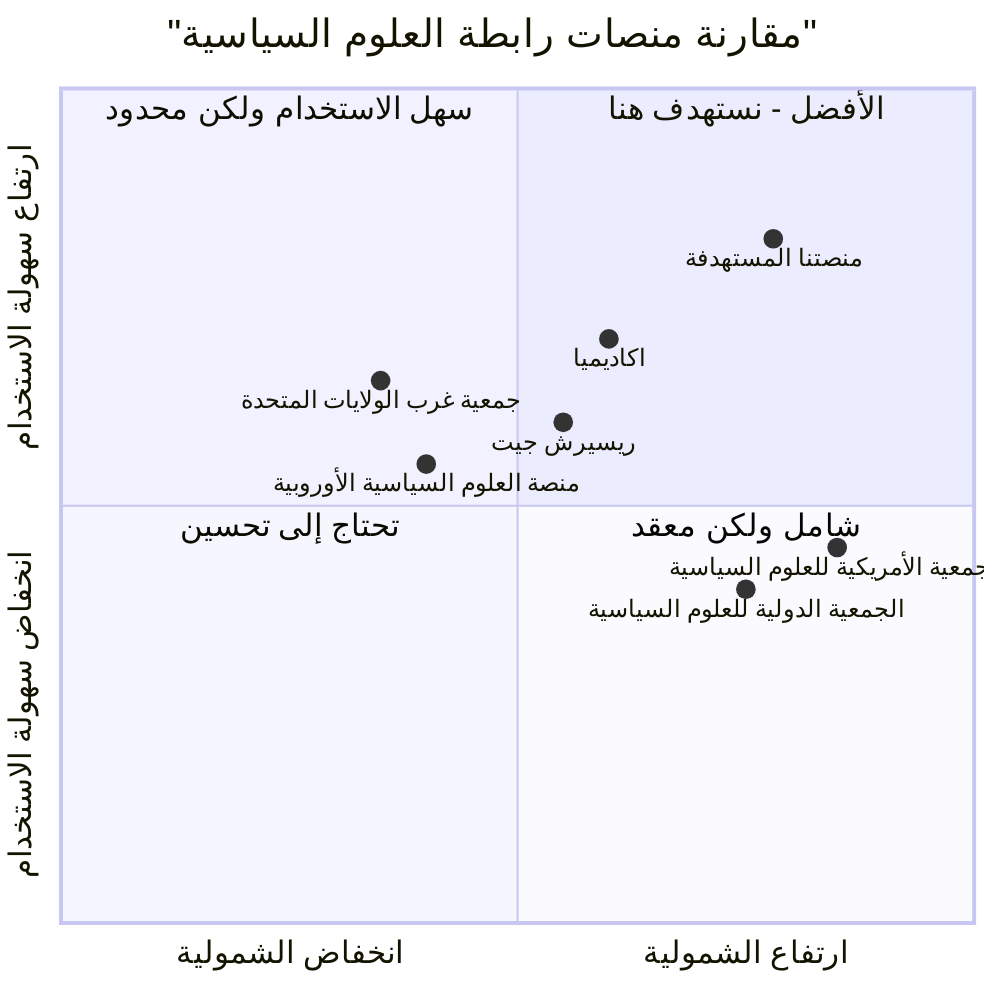

# وثيقة متطلبات المنتج - تطوير منصة رابطة العلوم السياسية

**تاريخ الإصدار**: 14 أبريل 2025

## معلومات المشروع
- **اسم المشروع**: political_science_association_platform
- **لغة البرمجة**: React, JavaScript, Tailwind CSS

### المتطلبات الأصلية
تطوير منصة رابطة العلوم السياسية عبر الإنترنت لتعزيز التعاون ومشاركة الموارد بين الباحثين والطلاب والمهنيين في مجال العلوم السياسية، مع التركيز على تحسين تجربة المستخدم وتوفير وظائف متقدمة لإدارة العضوية.

## 1. تعريف المنتج

### أهداف المنتج
1. **تعزيز التواصل والتعاون العلمي**: إنشاء منصة متكاملة تسهل التواصل وتبادل المعرفة بين الباحثين والأكاديميين في مجال العلوم السياسية.
2. **تحسين إدارة الموارد والمحتوى العلمي**: توفير نظام متطور لإدارة ونشر المقالات والأبحاث والموارد العلمية.
3. **رفع كفاءة إدارة العضوية والفعاليات**: تطوير أنظمة متكاملة لإدارة العضوية والفعاليات بشكل يلبي احتياجات الرابطة وأعضائها.

### قصص المستخدمين
1. **كباحث في العلوم السياسية**، أريد الوصول إلى أحدث الأبحاث والمقالات في مجال تخصصي بسهولة، حتى أستطيع البقاء على اطلاع بأحدث التطورات العلمية.

2. **كعضو في الرابطة**، أريد تحديث بياناتي الشخصية وإدارة عضويتي بسهولة، حتى أتمكن من الاستفادة من جميع المزايا المتاحة لي.

3. **كطالب دراسات عليا**، أريد المشاركة في النقاشات والمنتديات العلمية، حتى أستطيع تبادل الأفكار والتعلم من الخبراء في المجال.

4. **كمنظم للفعاليات في الرابطة**، أريد إنشاء وإدارة الفعاليات والمؤتمرات بسهولة، حتى أضمن تنظيماً ناجحاً وحضوراً فعالاً.

5. **كمدير للرابطة**، أريد الحصول على إحصاءات وتحليلات دقيقة عن أنشطة المنصة والأعضاء، حتى أتمكن من اتخاذ قرارات استراتيجية مبنية على البيانات.

### تحليل المنافسين

| اسم المنافس | الإيجابيات | السلبيات |
|------------|-----------|----------|
| الجمعية الأمريكية للعلوم السياسية (APSA) | منصة شاملة مع أكثر من 15,000 عضو، محتوى علمي غني، فرص وظيفية، مجلات علمية مرموقة | واجهة مستخدم معقدة، تكلفة عضوية مرتفعة، عملية التسجيل طويلة |
| جمعية غرب الولايات المتحدة للعلوم السياسية | تركيز إقليمي، فعاليات متخصصة، مجتمع متماسك | محدودية الموارد، قلة الخيارات التقنية، تحديثات غير منتظمة للمحتوى |
| الجمعية الدولية للعلوم السياسية | تنوع دولي، تعدد اللغات، شبكة عالمية واسعة | تحديات في التواصل بسبب التنوع اللغوي، تأخر في تحديث المنصة التقنية |
| منصة اكاديميا للباحثين | سهولة مشاركة الأبحاث، شبكة تواصل واسعة، ميزات بحث متقدمة | ليست متخصصة في العلوم السياسية، إعلانات مزعجة، قيود على المستخدمين المجانيين |
| ريسيرش جيت | تركيز على المشاركة العلمية، قياسات تأثير البحوث، تواصل مباشر مع الباحثين | ليست مخصصة للعلوم السياسية، واجهة معقدة، محدودية في إدارة الفعاليات |
| منصة العلوم السياسية الأوروبية | تركيز على القضايا الأوروبية، مؤتمرات منتظمة، منشورات متخصصة | نطاق جغرافي محدود، محتوى أقل شمولية، خيارات تفاعل محدودة |
| المنتج المستهدف | تصميم متجاوب وحديث، تخصص في العلوم السياسية، تكامل جميع الخدمات، تفاعل مجتمعي قوي، أدوات تعاون بحثي | مشروع جديد يحتاج لبناء قاعدة مستخدمين، يتطلب موارد لتطوير جميع الميزات المطلوبة |

### رسم بياني تنافسي رباعي



## 2. المواصفات التقنية

### تحليل المتطلبات

#### 1. تحسين واجهة المستخدم
يهدف هذا التطوير إلى إنشاء واجهة مستخدم متجاوبة وجذابة تعكس هوية الرابطة وتسهل تجربة المستخدم على جميع الأجهزة.

**المتطلبات الرئيسية**:
- تصميم متجاوب يعمل بسلاسة على جميع الأجهزة (سطح المكتب، الهواتف الذكية، الأجهزة اللوحية)
- نظام ألوان موحد يعكس هوية الرابطة
- تطبيق مبادئ التصميم الحديثة مع التركيز على سهولة الاستخدام وسرعة الوصول للمعلومات
- تطوير قوالب موحدة لجميع صفحات المنصة

#### 2. تطوير نظام العضوية
تطوير نظام متكامل لإدارة العضوية يدعم مستويات مختلفة من العضوية ويوفر نظام دفع آمن وسهل الاستخدام.

**المتطلبات الرئيسية**:
- دعم مستويات مختلفة للعضوية (طالب، باحث، أكاديمي، مهني، مؤسسي)
- نظام دفع آمن مع دعم لطرق دفع متعددة
- إدارة دورة حياة العضوية بالكامل (التسجيل، التجديد، الترقية، الإلغاء)
- لوحة تحكم للعضو لإدارة معلومات الحساب والاشتراك

#### 3. تعزيز المحتوى العلمي
إنشاء مكتبة موارد متكاملة وتطوير قسم خاص للأبحاث والدراسات مع إمكانيات بحث متقدمة.

**المتطلبات الرئيسية**:
- إنشاء مستودع رقمي للأبحاث والمقالات العلمية
- تطوير نظام تصنيف وفهرسة متقدم للمحتوى العلمي
- دعم البحث المتقدم بمعايير متعددة
- نظام لإدارة حقوق الملكية الفكرية والنشر

#### 4. تحسين التفاعل بين الأعضاء
تطوير أدوات تفاعلية لتعزيز التواصل والتعاون بين أعضاء الرابطة.

**المتطلبات الرئيسية**:
- منصة للنقاش وتبادل الآراء حول القضايا والمواضيع العلمية
- أدوات للتعاون البحثي وتنسيق المشاريع المشتركة
- نظام للتواصل المباشر بين الأعضاء
- مجموعات اهتمام متخصصة حسب المجالات البحثية

#### 5. تطوير نظام إدارة الفعاليات
تطوير نظام متكامل لإدارة الفعاليات والمؤتمرات العلمية بشكل فعال.

**المتطلبات الرئيسية**:
- تقويم تفاعلي للفعاليات القادمة
- نظام لإدارة التسجيل والحضور للفعاليات
- دعم للفعاليات الافتراضية والهجينة
- نظام لجدولة الجلسات وإدارة المتحدثين

#### 6. تحسين الأمان وخصوصية البيانات
تعزيز أمن المنصة وحماية خصوصية بيانات المستخدمين.

**المتطلبات الرئيسية**:
- تنفيذ تشفير متقدم لبيانات المستخدمين
- تطبيق أفضل ممارسات الأمان في تطوير الويب
- الالتزام بمعايير حماية البيانات العالمية
- نظام للنسخ الاحتياطي واستعادة البيانات

#### 7. تطوير لوحات التحكم
إنشاء لوحات تحكم مخصصة لمختلف فئات المستخدمين مع إحصاءات وتحليلات متقدمة.

**المتطلبات الرئيسية**:
- لوحات تحكم مخصصة حسب نوع المستخدم (مدير، عضو، باحث، إلخ)
- عرض إحصاءات وتحليلات عن استخدام المنصة
- أدوات لإدارة المحتوى والأعضاء والفعاليات
- تقارير قابلة للتخصيص

### قائمة المتطلبات حسب الأولوية

#### P0 (أساسي - يجب تنفيذه)
1. تصميم واجهة مستخدم متجاوبة تعمل على جميع الأجهزة
2. نظام إدارة العضوية مع دعم مستويات مختلفة
3. نظام دفع آمن للاشتراكات والرسوم
4. مستودع رقمي أساسي للأبحاث والمقالات
5. منتدى نقاش أساسي للتواصل بين الأعضاء
6. تطبيق معايير الأمان الأساسية وحماية البيانات
7. لوحة تحكم للمديرين بوظائف أساسية

#### P1 (مهم - يجب تنفيذه)
1. نظام بحث متقدم في المحتوى العلمي
2. أدوات للتعاون البحثي بين الأعضاء
3. نظام متكامل لإدارة الفعاليات والمؤتمرات
4. تطوير نظام التصنيف والفهرسة للمحتوى العلمي
5. نظام للإشعارات والتنبيهات للمستخدمين
6. إحصاءات وتحليلات متقدمة في لوحات التحكم
7. تقويم تفاعلي للفعاليات القادمة

#### P2 (مرغوب - يمكن تأجيله)
1. دعم متعدد اللغات للمنصة
2. تكامل مع منصات التواصل الاجتماعي
3. تطبيق للهاتف المحمول
4. نظام متقدم لإدارة المؤتمرات الافتراضية
5. أدوات متقدمة لتحليل البيانات وعرضها بصرياً
6. نظام للتوصيات المخصصة للمحتوى العلمي
7. تكامل مع أدوات بحثية خارجية وقواعد بيانات أكاديمية

### مسودة تصميم واجهة المستخدم

#### 1. الصفحة الرئيسية
```
+----------------------------------------------------+
|  الشعار   القائمة الرئيسية           تسجيل/دخول  |
+----------------------------------------------------+
|                                                    |
|  +------------------+      +-------------------+   |
|  |  أخبار وفعاليات |      | الأبحاث الحديثة  |   |
|  |                  |      |                   |   |
|  |                  |      |                   |   |
|  |                  |      |                   |   |
|  +------------------+      +-------------------+   |
|                                                    |
|  +--------------------------------------------------+
|  |              إحصائيات ومعلومات                 |
|  |                                                  |
|  +--------------------------------------------------+
|                                                    |
|  +--------------------------------------------------+
|  |                 مميزات العضوية                  |
|  |                                                  |
|  +--------------------------------------------------+
|                                                    |
+----------------------------------------------------+
|                   تذييل الصفحة                    |
+----------------------------------------------------+
```

#### 2. صفحة العضوية
```
+----------------------------------------------------+
|  الشعار   القائمة الرئيسية           تسجيل/دخول  |
+----------------------------------------------------+
|                                                    |
|  +--------------------------------------------------+
|  |                  أنواع العضوية                  |
|  |                                                  |
|  |  +---------------+ +---------------+ +-------+   |
|  |  |   طالب        | |    باحث       | | خبير  |   |
|  |  |               | |               | |       |   |
|  |  |  المميزات    | |  المميزات    | |المميزات|   |
|  |  |  السعر       | |  السعر       | | السعر  |   |
|  |  |  اشترك الآن  | |  اشترك الآن  | |اشترك  |   |
|  |  +---------------+ +---------------+ +-------+   |
|  |                                                  |
|  +--------------------------------------------------+
|                                                    |
|  +--------------------------------------------------+
|  |                 مميزات العضوية                  |
|  |                                                  |
|  +--------------------------------------------------+
|                                                    |
+----------------------------------------------------+
|                   تذييل الصفحة                    |
+----------------------------------------------------+
```

#### 3. صفحة المكتبة العلمية
```
+----------------------------------------------------+
|  الشعار   القائمة الرئيسية           تسجيل/دخول  |
+----------------------------------------------------+
|                                                    |
|  +-------------+      +------------------------+   |
|  |             |      |                        |   |
|  | التصنيفات  |      |  نتائج البحث          |   |
|  |             |      |                        |   |
|  |             |      |                        |   |
|  |             |      |                        |   |
|  |             |      |                        |   |
|  |             |      |                        |   |
|  |             |      |                        |   |
|  |             |      |                        |   |
|  |             |      |                        |   |
|  |             |      |                        |   |
|  +-------------+      +------------------------+   |
|                                                    |
|  +--------------------------------------------------+
|  |                 خيارات متقدمة                   |
|  |                                                  |
|  +--------------------------------------------------+
|                                                    |
+----------------------------------------------------+
|                   تذييل الصفحة                    |
+----------------------------------------------------+
```

### الأسئلة المفتوحة

1. **هل ينبغي تطوير تطبيق للهاتف المحمول كجزء من المشروع أم التركيز على تصميم موقع متجاوب فقط؟**
   التركيز الأولي سيكون على تطوير موقع متجاوب يعمل بشكل جيد على جميع الأجهزة، مع النظر في إمكانية تطوير تطبيق للهاتف المحمول في مرحلة لاحقة.

2. **ما هي طرق الدفع التي يجب دعمها في نظام الدفع؟**
   يجب استكشاف الخيارات المتاحة بما في ذلك بطاقات الائتمان والدفع الإلكتروني والتحويل المصرفي، مع الأخذ في الاعتبار تكامل منصات الدفع المختلفة.

3. **كيف سيتم التعامل مع حقوق الملكية الفكرية للمحتوى العلمي؟**
   يجب تطوير سياسة واضحة لحقوق الملكية الفكرية والنشر، مع نظام لإدارة هذه الحقوق على المنصة.

4. **ما هو النهج المفضل للتكامل مع قواعد البيانات الأكاديمية الخارجية؟**
   يجب استكشاف خيارات التكامل مع قواعد البيانات الأكاديمية الرئيسية لتوسيع نطاق المحتوى المتاح للأعضاء.

5. **هل ستكون هناك حاجة لدعم متعدد اللغات في المنصة؟**
   يجب تقييم الحاجة لدعم متعدد اللغات بناءً على التوزيع الجغرافي المستهدف للأعضاء، مع الأخذ في الاعتبار تعقيد وتكلفة تنفيذ هذه الميزة.

## 3. الخاتمة

هذه الوثيقة تقدم نظرة شاملة على متطلبات تطوير منصة رابطة العلوم السياسية، مع التركيز على سبعة مجالات رئيسية للتحسين. التنفيذ الناجح لهذه المتطلبات سيؤدي إلى إنشاء منصة متكاملة وحديثة تلبي احتياجات الرابطة وأعضائها، وتعزز التعاون العلمي والأكاديمي في مجال العلوم السياسية.

يمكن البدء في تنفيذ المشروع على مراحل، مع التركيز أولاً على المتطلبات ذات الأولوية P0، ثم الانتقال إلى المتطلبات P1 وP2 في المراحل اللاحقة.